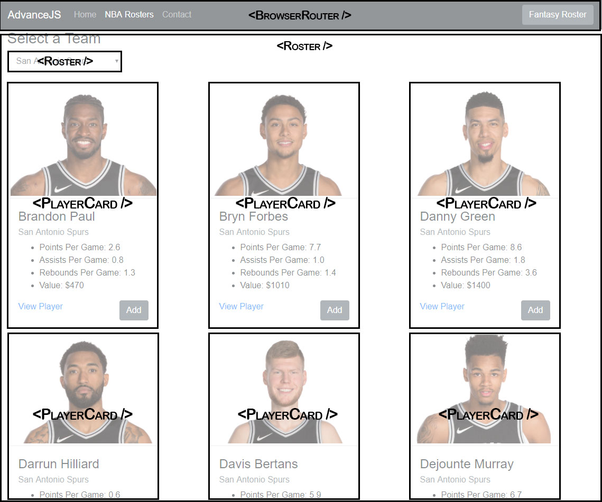

## Advanced JavaScript CA2

## User Stories
 * As a fan of NBA, I want to filter by Team, so that I can view the roster of the selected team.
 * As a fan of some specific players in the NBA, I want to select a player, so that I can view more details of the selected player.
 * As a fan of NBA, I want to select a player and add it to a Fantasy Roster, so that I can create my own Fantasy Roster.

## Installing and Running the app
 * download the project
 * open a node.js command prompt
 * change the directory to the project folder path using the cd command. e.g. `cd pathname`
 * Run `npm install` to install the project.
 * Run `npm start` to run the app.

## App Features
 * BrowserRouters are used in the navigation menu. Clicking on a one of the menus will reroute the user to a different page. e.g. clicking on NBA Roster menu will navigate the user to `localhost:3000/nbaroster`.
 * [Bootstrap 4](https://getbootstrap.com/) framework was used for styling the app.
 * The API used for this app is [NBA Player API](https://nba-players.herokuapp.com/)
   - The API was used [Roster.js](./src/Component/Roster.js) for gathering data of all players.
   - Used in PlayerCard component for requesting images.
 - Components created are found [here](./src/Component)
   - [Main.js](./src/Component/Main.js) contains all the routers that was used for navigating around the app with the navigation menu.
   - [Roster.js](./src/Component/Roster.js) contains the main body of the app. All players from the selected team (from the select box above the player cards) will be displayed on the browser. Selecting a team from the select box will automatically update the displayed rosters, which is done by an onChange event which will make the request for the rosters from the API everytime a new team is selected.
   - 
   - [Playercard.js](./src/Component/PlayerCard.js) contains the data of each players that was gathered by the API request from [Roster.js](./src/Component/Roster.js). Each player card will have a 'View Player' and 'Add' buttons. 
   - 
   - Clicking on 'View Player' will reroute the user to `localhost:3000/player/firstName/lastName` which is a page for the selected player. This page is the [Player.js](./src/Component/Player.js) component that makes the request from the API for the selected player.
   -  
   - `firstName` and `lastName` are props that was passed within the 'View Player' link from the [Playercard.js](./src/Component/PlayerCard.js) component.
   - Clicking on the 'Add' button will add the selected player in the Fantasy Roster list. This list can be viewed by clicking on the 'Fantasy Roster' button from the navigation menu.
   

## Wireframes
 
 
 

## Reflection
 * The app is working fine with a few bugs. Users will be able to select a team and the roster for that team will be displayed on the browser, users will also be able to view a specific player and will be able to add a player into a Fantasy Roster. However some problems are still present:
   - Some images are not displaying, this is because the API for requesting players doesn't come with images, a different API call must be made to request for the images. The data that comes with the API that requests for players simplifies the players names instead of giving the name in their proper characters, for example Lúc or J.R. and the API doesn't divide the names between first and last. This is the source of the image request problem because when making an API request, a first and last name is required by the API, e.g. https://nba-players.herokuapp.com/players/curry/stephen. This problem was solved by dividing the name using a `.split(' ')` command. However the problems for the special characters were still not be solved.
   - For the issue of images not displaying, I tried using the `onError` attribute to use a default image to replace the errors, but wasn't successful.
 * What I learned from this project. 
   - I've learned how to write different components and connect them with each other.
   - I've learned how to properly use props.
   - I've learned properly on how the Browser Router works.
   - I've learned new ways on how to make a request from an API and use this data to be rendered on a browser.
